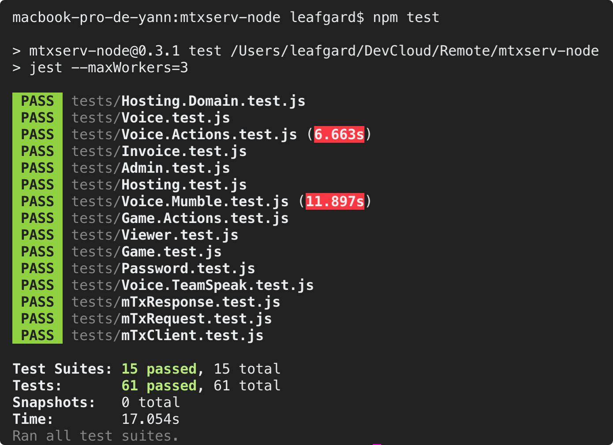

<p align="center"></p>
<h3 align="center">mtxserv-node</h3>
<p align="center"><i>Node.JS SDK providing easy access to mTxServ's API</i><p>

<p align="center">
  <a href="https://forthebadge.com">
    
  </a>
  <a href="https://forthebadge.com">
      
  </a>
  <a href="https://github.com/Leafgard/mtxserv-node/issues">
      
  </a>
  <a href="https://github.com/Leafgard/mtxserv-node/stargazers">
      
  </a>
  <a href="https://paypal.me/Leafgard">
    
  </a>
</p>

<p align="center">
  <a href="#installation">Installation</a> •
  <a href="#usage">Usage</a> •
  <a href="#classes-&-methods">Classes & Methods</a> •
  <a href="#testing">Testing</a> •
  <a href="#notes">Notes</a> •
  <a href="#contribution">Contribution</a> •
  <a href="#built-with">Built With</a> •
  <a href="#members">Members</a> •
  <a href="#license">License</a>
</p>

## Installation

```bash
$ npm i mtxserv-node
```

## Usage

```js
// Initiate the client
const mTxServ = require('mtxserv-node')
const client = mTxServ.initialize({
  clientId: 'YOUR-CLIENT-ID',
  clientSecret: 'YOUR-CLIENT-SECRET',
  apiToken: 'YOUR-API-KEY'
})

// Use the client (Example)
let invoices = client.Invoice.getInvoicesList()
```

## Classes & Methods

### Architecture

Basically, methods are called like this:

```js
something = client.Class.{subClass.}Method(params)
```

#### To-Do (Checked only when completly working)

- [x] **Admin**
- [ ] **Game**
  - [ ] ARK
  - [ ] ARKWorkshop
  - [x] Actions
  - [ ] Arma3
  - [ ] Backup
  - [ ] Bukkit
  - [ ] CSGO
  - [ ] Cod4
  - [ ] FTP
  - [ ] Files
  - [ ] GmodBackdoor
  - [ ] HTLV
  - [ ] History
  - [x] Infos
  - [ ] Maps
  - [ ] MineBackup
  - [ ] MineBan
  - [ ] MineConfig
  - [ ] MineOperators
  - [ ] MineVersion
  - [ ] MineWhiteList
  - [ ] Minecraft
  - [ ] MineLive
  - [ ] Plugins
  - [ ] RestoreExpired
  - [ ] SRCDS
  - [ ] SRCDSPlugins
  - [ ] SRCDSWorkshop
  - [ ] STEAMStats
  - [ ] Tasks
  - [ ] eBOT
- [x] **Hosting**
  - [x] Domain
- [ ] **Invoice**
- [x] **Password**
- [x] **Viewer**
- [x] **Voice**
  - [x] Actions
  - [x] Mumble
  - [x] Teamspeak

## Testing

<p align="center"></p>

Tests (using JEST) are avaiable in `./tests`.

We are using **dotenv** to pass parameters to each test, please create a `.env` at root directory or modify the tests.

Run the tests:

```bash
$ npm test
```

## Notes
### Notations
**gsId** Corresponds to **GameServer's ID**

**iId** Corresponds to **Invoice's ID**

**uId** Corresponds to **User's ID**

(**NB, Weird**: `Admin.getAdminList(iId)` returns an Array of users. **uId** corresponds to **user.id** and not **user.user_id** provided by the API !)

### Grants List
#### Global (Game / Voice / Hosting)
- **GRANTING_ACTIONS** - Actions (Start, Stop, Restart) Ability
- **GRANTING_FTP** - Files (WebFTP + FTP) Access
- **GRANTING_MYSQL** - MySQL Access
- **GRANTING_DOMAIN** - Domain Access
- **GRANTING_COLLABORATORS** - Collaborators Management
- **GRANTING_BACKUP** - Backups Management
- **GRANTING_TASKS** - Periodic Tasks Management
- **GRANTING_REINSTALL** - Reinstall Ability
- **GRANTING_RESTORE_EXPIRED** - Restore Expired Server Ability
- **GRANTING_CONFIGURATION** - Configuration Access
- **GRANTING_INVOICE** - Invoice Access
- **GRANTING_PRIVILEGE_KEYS** - Privileges Management
- **GRANTING_MUMBLE_CONSOLE** - Mumble Console Access

#### Game
- **GAME_GRANTING_ACTIONS**: Actions (Start, Stop, Restart, Force restart, Update) Ability
- **GAME_GRANTING_CONFIGURATION**: Configuration Access
- **GAME_GRANTING_TASKS**: Periodic Tasks Management
- **GAME_GRANTING_BACKUP**: Backups Management
- **GAME_GRANTING_REINSTALL**: Reinstall Ability
- **GAME_GRANTING_COLLABORATORS**: Collaborators Management

#### Hosting
- **HOSTING_GRANTING_DOMAIN**: Domain Access
- **HOSTING_GRANTING_FTP**: Files (WebFTP + FTP) Access
- **HOSTING_GRANTING_MYSQL**: MySQL Access
- **HOSTING_GRANTING_COLLABORATORS**: Collaborators Management

#### Voice (Mumble / TeamSpeak)
- **TEAMSPEAK_GRANTING_ACTIONS**: Actions (Start, Stop, Restart, Exec CVAR) Ability
- **TEAMSPEAK_GRANTING_CONFIGURATION**: Configuration Access
- **TEAMSPEAK_GRANTING_PRIVILEGE_KEYS**: Privileges Keys Management
- **TEAMSPEAK_GRANTING_REINSTALL**: Reinstall Ability
- **TEAMSPEAK_GRANTING_COLLABORATORS**: Collaborators Management
- **MUMBLE_GRANTING_ACTIONS**: Actions (Start, Stop, Restart) Ability
- **MUMBLE_GRANTING_CONFIGURATION**: Configuration Access
- **MUMBLE_GRANTING_MUMBLE_CONSOLE**: Console Access
- **MUMBLE_GRANTING_REINSTALL**: Reinstall Ability
- **MUMBLE_GRANTING_COLLABORATORS**: Collaborators Management

### Remarks

**Invoice**
- *POST* `/invoices/${iId}/offers/game` - **Documentation is wrong**, don't know what it is for

**Game**
- *PUT* `/game/${gsId}/games` - Couldn't test it because **I don't have a server to test on**
- *PUT* `/game/${gsId}/slots` - Couldn't test it because **I don't know what are the slots possibilities**

## Contribution

* Fork the repository, use the development branch and please create pull requests to contribute to this project.
* Follow the same coding style as used in the project. Pay attention to the
  usage of tabs, spaces, newlines and brackets. Try to copy the aesthetics as
  best as you can.
* Write [good commit messages](http://tbaggery.com/2008/04/19/a-note-about-git-commit-messages.html),
  explain what your patch does, and why it is needed.
* Keep it simple: Any patch that changes a lot of code or is difficult to
  understand should be discussed before you put in the effort.

## Built With

* [dotenv](https://www.npmjs.com/package/dotenv)^6.2.0 - Dotenv is a zero-dependency module that loads environment variables from a .env file into process.env
* [jest](https://www.npmjs.com/package/jest)^23.6.0 - Delightful JavaScript Testing
* [sync-request](https://www.npmjs.com/package/sync-request)^6.0.0 - Make synchronous web requests with cross platform support.

## Members

* **Yann SEGET** - *Main author* - *dev@leafgard.fr*

[https://github.com/Leafgard/mtxserv-node](https://github.com/Leafgard/mtxserv-node)

## License

This project is licensed under the MIT License - see the [LICENSE.md](LICENSE.md) file for details.
