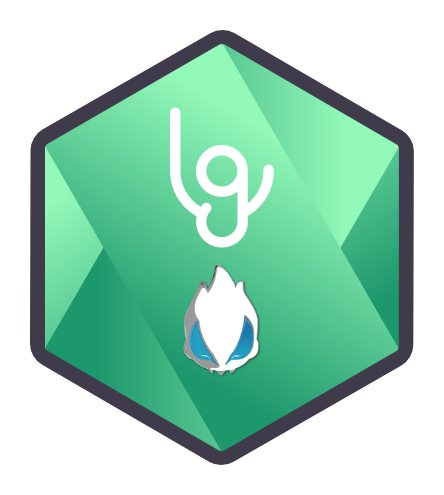

<p align="center"></p>
<h3 align="center">mtxserv-node</h3>
<p align="center"><i>Node.JS SDK providing easy access to mTxServ's API</i><p>

<p align="center">
  <a href="https://forthebadge.com">
    
  </a>
  <a href="https://forthebadge.com">
      
  </a>
  <a href="https://github.com/Leafgard/mtxserv-node/issues">
      
  </a>
  <a href="https://github.com/Leafgard/mtxserv-node/stargazers">
      
  </a>
  <a href="https://paypal.me/Leafgard">
    
  </a>
</p>

<p align="center">
  <a href="#installation">Installation</a> •
  <a href="#usage">Usage</a> •
  <a href="#classes-&-methods">Classes & Methods</a> •
  <a href="#testing">Testing</a> •
  <a href="#notes">Notes</a> •
  <a href="#contribution">Contribution</a> •
  <a href="#built-with">Built With</a> •
  <a href="#members">Members</a> •
  <a href="#license">License</a>
</p>

## Installation

```bash
$ npm i mtxserv-node
```

## Usage

```js
// Initiate the client
const mTxServ = require('mtxserv-node')
const client = mTxServ.initialize({
  clientId: 'YOUR-CLIENT-ID',
  clientSecret: 'YOUR-CLIENT-SECRET',
  apiToken: 'YOUR-API-KEY'
})

// Use the client (Example)
let invoices = client.Invoice.getInvoicesList()
```

## Classes & Methods

### Architecture

Basically, methods are called like this:

```js
something = client.Class.{subClass.}Method(params)
```

#### To-Do (Checked only when completly working)

- [ ] **Admin**
- [ ] **Game**
  - [ ] ARK
  - [ ] ARKWorkshop
  - [ ] Actions
  - [ ] Arma3
  - [ ] Backup
  - [ ] Bukkit
  - [ ] CSGO
  - [ ] Cod4
  - [ ] FTP
  - [ ] Files
  - [ ] GmodBackdoor
  - [ ] HTLV
  - [ ] History
  - [ ] Infos
  - [ ] Maps
  - [ ] MineBackup
  - [ ] MineBan
  - [ ] MineConfig
  - [ ] MineOperators
  - [ ] MineVersion
  - [ ] MineWhiteList
  - [ ] Minecraft
  - [ ] MineLive
  - [ ] Plugins
  - [ ] RestoreExpired
  - [ ] SRCDS
  - [ ] SRCDSPlugins
  - [ ] SRCDSWorkshop
  - [ ] STEAMStats
  - [ ] Tasks
  - [ ] eBOT
- [ ] **Hosting**
  - [ ] Domain
- [ ] **Invoice**
- [x] **Password**
- [ ] **Viewer**
- [ ] **Voice**
  - [ ] Actions
  - [ ] Mumble
  - [ ] Teamspeak

## Testing

Tests (using JEST) are avaiable in `./tests`.

We are using **dotenv** to pass parameters to each test, please create a `.env` at root directory or modify the tests.

Run the tests:

```bash
$ npm test
```

## Notes

**Admin**
- `addAdmin(sId)` - encounters **400 BAD REQUEST** using **POST METHOD** with the following layout:
  - *POST* https://mtxserv.com/api/v1/admins/SERVER_ID?access_token=ACCESS_TOKEN
  - *param (required): user*: john@doe.com
  - *param (optional): roles[]*: []
- `removeAdmin(sId)` - encounters **404 NOT FOUND** using **DELETE METHOD** with the following layout:
  - *DELETE* https://mtxserv.com/api/v1/admins/SERVER_ID/USER_ID?access_token=ACCESS_TOKEN

**Invoice**
- `changeInvoiceSlots(sId, slots)` - **Not enough documented**, couldn't test it according to actual offers
- *POST* `/invoices/${sId}/offers/game` - **Documentation is wrong**, don't know what it is for

**Viewer**
- `getTeamspeakServerData(sId)` - Couldn't test it because **I don't have a Teamspeak server**

**Game**
- `sendCommand(sId, cmd)` - encounters **404 NOT FOUND** using **POST METHOD** with the following layout:
  - *POST* https://mtxserv.com/api/v1/game/153087/command?access_token=ACCESS_TOKEN
  - *param (required): command*: /help
- *PUT* `/game/${sId}/games` - Couldn't test it because `getGameList(sId)` **doesn't work**.
- `getGameList(sId)` - encounters **404 NOT FOUND** using **GET METHOD** with the following layout:
  - *GET* https://mtxserv.com/api/v1/game/SERVER_ID/games?access_token=ACCESS_TOKEN
- *PUT* `/game/${sId}/slots` - Couldn't test it because I don't know what are the **slots possibilities**.
- `getGameServersList(id)` - encounters **403 FORBIDDEN** using **GET METHOD** with the following layout:
  - *GET* https://mtxserv.com/api/v1/game/CLIENT_ID/servers?access_token=ACCESS_TOKEN
- `getGameServerById(id, sId)` - encounters **403 FORBIDDEN** using **GET METHOD** with the following layout:
  - *GET* https://mtxserv.com/api/v1/game/CLIENT_ID/servers/SERVER_ID?access_token=ACCESS_TOKEN 

## Contribution

* Fork the repository, use the development branch and please create pull requests to contribute to this project.
* Follow the same coding style as used in the project. Pay attention to the
  usage of tabs, spaces, newlines and brackets. Try to copy the aesthetics as
  best as you can.
* Write [good commit messages](http://tbaggery.com/2008/04/19/a-note-about-git-commit-messages.html),
  explain what your patch does, and why it is needed.
* Keep it simple: Any patch that changes a lot of code or is difficult to
  understand should be discussed before you put in the effort.

## Built With

* [dotenv](https://www.npmjs.com/package/dotenv)^6.2.0 - Dotenv is a zero-dependency module that loads environment variables from a .env file into process.env
* [jest](https://www.npmjs.com/package/jest)^23.6.0 - Delightful JavaScript Testing
* [sync-request](https://www.npmjs.com/package/sync-request)^6.0.0 - Make synchronous web requests with cross platform support.

## Members

* **Yann SEGET** - *Main author* - *dev@leafgard.fr*

[https://github.com/Leafgard/mtxserv-node](https://github.com/Leafgard/mtxserv-node)

## License

This project is licensed under the MIT License - see the [LICENSE.md](LICENSE.md) file for details.
